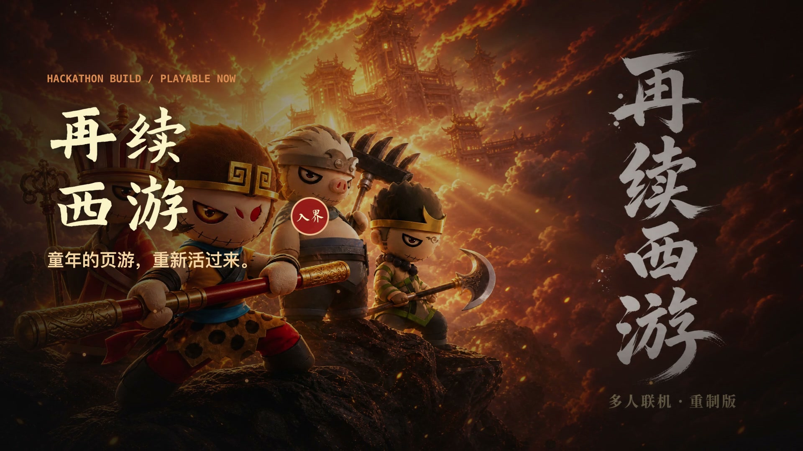
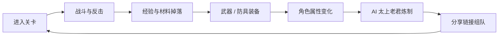
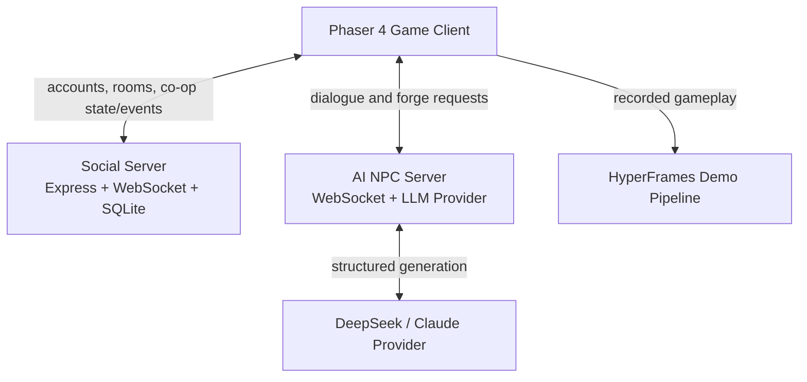

# 再续西游 / Zaixu Xiyou

<p align="center"><strong>不是怀旧截图，是现在就能玩的西游。</strong></p>

<p align="center">
  <a href="https://zaixu.qmledmq.cn:8443/"><strong>Play Live</strong></a>
  ·
  <a href="https://zaixu.qmledmq.cn:8443/demo/"><strong>Watch 60s Demo</strong></a>
  ·
  <a href="https://zaixu.qmledmq.cn:8443/demo/zaixu-xiyou-hackathon.mp4"><strong>Direct MP4</strong></a>
</p>

<p align="center">
  <a href="https://zaixu.qmledmq.cn:8443/demo/">
    
  </a>
</p>

《再续西游》是一款可直接在浏览器游玩的西游动作 RPG。它不是给旧游戏换一层皮，而是从资源、动画、关卡空间、战斗节奏和数值逻辑开始做系统考古，再把装备成长、房主权威联机和真正能改变游戏状态的 AI 太上老君接进同一条可玩闭环。

## Judge It in 90 Seconds

1. 打开 [在线版本](https://zaixu.qmledmq.cn:8443/)，注册账号并选择孙悟空。
2. 进入九重天或天宫道：`A/D` 移动，`J` 攻击，`K` 跳跃，`W/↑` 交互。
3. 击败怪物、拾取材料，按 `B` 打开背包，观察武器与防具如何改变角色属性。
4. 回到世界地图进入炼丹炉，让太上老君根据材料和自然语言请求打造装备。
5. 打开联机大厅，创建房间并复制邀请链接；另一位玩家点开链接即可进入同一房间。

完整演示视频为 **1920×1080 / 60 fps / 60 秒**，全部功能画面来自真实运行中的游戏，而不是概念稿或后期假 UI。

## Why It Is Cool

### 1. Restoration as Systems Archaeology

我们复原的不只是图片。关卡平台、传送空间、人物与怪物落脚线、攻击帧、武器覆盖层、受击反馈、伤害数字、经验曲线和掉落表都重新进入了可执行系统。九重天和天宫道因此不是两张背景图，而是两套能跑通战斗、成长与通关流程的关卡。

### 2. AI That Mutates Real Game State

太上老君不是一个装饰性聊天框。玩家提交材料与炼制意图后，AI NPC 会理解请求并返回结构化装备；服务端和客户端会再次校验效果词表、数值预算和材料事务，随后扣除材料、生成装备、写入背包并更新角色战斗属性。

```text
natural-language request
        ↓
AI Taishang Laojun
        ↓
validated equipment schema
        ↓
material transaction → inventory → combat stats
```

模型可以有创造力，但不能越过游戏规则。这让 AI 成为玩法的一部分，而不是一段旁白。

### 3. Shareable Co-op with Host Authority

房间链接可以直接恢复目标房间；大厅提供创建、加入、准备和开始流程。战斗内由房主负责怪物生成、位置、伤害结算与关卡事件，其他玩家发送移动状态和命中意图；过期序列会被丢弃，非房主伪造的怪物状态与结算会被拒绝。

### 4. One Complete Playable Loop



黑客松版本刻意聚焦这条完整闭环。尚未支持的角色、饰品与法宝不会作为虚假掉落混进游戏。

## Shipped Features

- Two reconstructed levels: **Nine Heavens** and **Heavenly Palace Road**.
- Wukong melee combat with fixed attack cadence, combo stages, hit effects, damage, knockback and enemy counterattacks.
- Monster pursuit, attacks, health, experience rewards and constrained wave progression.
- Weapon and armor slots tied to the unified hero identity and combat-stat model.
- Item drops, pickup, inventory, equipment, selling and persistent saves.
- Material locking, consume/refund semantics and forged-item insertion into the inventory.
- AI Taishang Laojun with thinking state, dialogue memory and schema-constrained equipment effects.
- Account login, SQLite persistence, room lifecycle, invite links and WebSocket co-op state/event channels.
- Host-authoritative monster state, hit settlement, hero damage and boss/level events.
- Responsive loading transitions instead of unexplained black screens.
- A reproducible HyperFrames video project with recorded 1080p60 gameplay clips, narration, music and SFX.

## Architecture



| Package | Responsibility |
| --- | --- |
| `game/` | Phaser 4, TypeScript and Vite game client |
| `social-server/` | Authentication, friends, rooms, invite flow and WebSocket fanout |
| `agent-server/` | Stateful AI NPC dialogue and validated forging output |
| `videos/zaixu-hackathon/` | Demo composition, gameplay recorders, narration and curated media |
| `docs/reference/` | Extracted behavior notes, original-game references and asset research |

## Local Development

Run the complete stack in three terminals.

```bash
cd social-server
npm install
JWT_SECRET=local-development-secret npm run start
```

```bash
cd agent-server
npm install
DEEPSEEK_API_KEY=your-key npm run start
```

```bash
cd game
npm install
VITE_SOCIAL_SERVER_URL=http://127.0.0.1:5182 \
VITE_NPC_SERVER_URL=ws://127.0.0.1:5181 \
npm run dev
```

The client runs at `http://127.0.0.1:5180/`. The AI service can also use the Claude provider through `NPC_BRAIN_PROVIDER=claude`.

## Verification

Latest verified result on the submitted revision:

| Surface | Result |
| --- | --- |
| Game client | **803/803 tests passed** and production build completed |
| Social server | Typecheck passed, **41 tests passed**, real HTTP/WebSocket room smoke passed |
| AI NPC server | Typecheck passed, **20/20 deterministic tests passed** |
| Demo video | HyperFrames lint: 0 warnings; browser validation: 0 errors; layout inspection: 0 issues |

```bash
cd game && npm test && npm run build
cd social-server && npm run typecheck && npm test
cd agent-server && npm run typecheck && npm run test:unit
cd videos/zaixu-hackathon && npm run check
```

The social-server end-to-end suite launches a real HTTP/WebSocket service. The AI server's real-provider test is intentionally separate because it requires provider credentials.

## Rebuild the Demo Video

```bash
cd videos/zaixu-hackathon
npm install
npm run check
npx hyperframes render . \
  --output renders/zaixu-xiyou-hackathon.mp4 \
  --fps 60 \
  --quality high
```

The storyboard, narration transcript, recording scripts and all curated source clips live beside the composition so the submission video can be audited and reproduced.

## Hackathon Note

This repository contains extracted legacy game assets for preservation-oriented hackathon prototyping. Review the original rights and redistribution constraints before reusing those assets outside this project.
