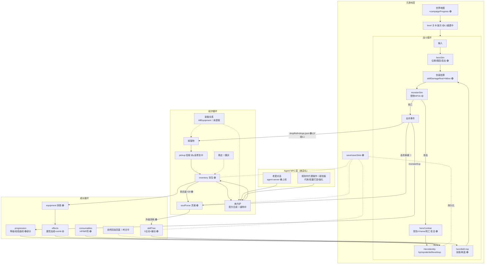

# 再续西游 系统图谱（systems-map）

2026-07-09 主会话整理。目的：把整个游戏的子系统依赖关系、每个节点的数值真源状态、闭环缺口一次理清，作为后续派工的总蓝图。派任何涉及数值/机制的棒之前先看本图，避免"修一个节点撑爆邻居"。

**真源优先级协议（用户 2026-07-09 确认：无官方内部数据可拿）**：
1. 原版主 SWF 反编译 AS3（唯一权威）
2. 上游仓库（kagami 移植源 / XinTianyu-Sky ZMXY 数值 JSON）——二手源，有占位符前科，用前对 AS3 抽验
3. 挖不到的，参考同类横版 ARPG 通行做法自创，**必须标注 invented + 设计判据**（可闭环、自洽、服务"像小时候"体感）

节点状态图例：🟢 AS3 逐字恢复｜🟡 适配/自建（有意为之或待升级）｜🔴 缺失（闭环漏洞）

## 一、总图

三个循环咬合成飞轮：**打怪（战斗）→ 掉落+经验+灵魂（经济进项）→ 装备/技能/等级（成长）→ 打更强的怪**。装备是经济与成长的咬合齿；灵魂是技能线的咬合齿；关卡难度墙是飞轮的阻尼。

## 二、节点状态账（按循环分组）

### 战斗循环
| 节点 | 模块 | 状态 | 备注/缺口 |
|---|---|---|---|
| 英雄物理/连招 | heroSim/jump/combo/locomotion | 🟢 | tick=33.3ms、连击窗对 kagami 文档；平台碰撞 climb-engine 在建 |
| 伤害公式 | skillDamageReal/hitbox/effects | 🟢 | 技能公式对 AS3（曾纠正 kagami 6.6x 偏差）；命中盒真 cell 等比（73cbf72） |
| 怪物 AI/数值 | monsterSim/monsterBehaviors + data/monsters + levels | 🟡 | L1/L2 数值 🟢逐字；AI 是综合重写（原版散在各 MonsterN.as）；**y 盲索敌/攻击 + 杂兵不出手排查中（climb-engine 扩单）** |
| 英雄受伤/死亡 | heroCombat/heroSurvivability | 🟢 | 复活 1500ms 为原创记档；怪物攻击力已真实化（min60 封顶已删） |
| Boss 专属机制 | — | 🔴 | 巫鹰 hit2 已做；L2 天王弹幕/机制未做，逐个啃 |

### 成长循环
| 节点 | 模块 | 状态 | 备注/缺口 |
|---|---|---|---|
| 等级/经验 | progression + monsterExp | 🟢部分 | Role1/2 曲线对 AS3 逐字；Role3/4 是 kagami 改动值，放开多角色前必须重验（audit-numbers-report） |
| 属性成长 | heroIdentity/heroGrowth/roleData | 🟢 | 挂靠统一 HeroIdentityState |
| 技能树 | skillTree/heroSkill/mp | 🟢 | 9 主动+嗜血被动已移植；被动页占位；UI 素面板待生图皮 |
| 药品 | consumables | 🟢 | SmallHP/BigHP 公式对 backpack1.swf；**获取渠道单一（掉落），原版商店渠道缺** |
| 自然回复 | — | 🔴 | 原版是否有站立回蓝/回血未考古（economy-archaeology 在查） |

### 经济循环
| 节点 | 模块 | 状态 | 备注/缺口 |
|---|---|---|---|
| 掉落 | dropRoll + drops.json | L2 🟢 / L1 🟡 | L2 对 fallEquip() 概率逐字；L1 材料名自建（服务旧炼丹炉设计，配方制重构时需对表重审） |
| 灵魂钱包 | soulPurse | 🟢 | 卖白装+20 逐字；技能升级消耗接通并持久化 |
| **击杀掉魂** | — | 🔴 | 经济最大漏洞：进项只有卖白装。AS3 链路 economy-archaeology 在挖 |
| **炼丹炉** | furnace + agent-server | 🔴 重构 | 2026-07-09 用户拍板翻案：**按原版配方复刻**；现"预算-clamp 自由生成"降级为技术储备。配方表考古中 |
| **装备池** | items（4 自建件） | 🔴 | AllEquipment.as 全表未提取，economy-archaeology 在评估；装备强化玩法归属同步考古 |
| 拾取 | pickup | 🟡 | y 盲已实锤（BattleScene:2385 写死 GROUND_Y），climb-engine 修复中 |
| 商店 | — | 🔴 | 世界地图入口置灰。赛内不做除非用户翻案；但药品获取渠道依赖它，需拍板替代（掉落加权/老君兑换） |

### 元游戏 + Agent 层
| 节点 | 模块 | 状态 | 备注/缺口 |
|---|---|---|---|
| 关卡链 | level + campaignProgress + WorldMapScene | 🟡 | L1 空间结构重建在途（爬塔/卷轴/持续刷怪）；L2 结构待同管线复检（sl21-23 走廊化风险同族） |
| 存档 | save/saveSlots | 🟢 | v1 版本化+迁移；6 槽 bug 已修 |
| NPC 对话 | agent-server（老君, DeepSeek） | 🟢 | home 24h 在线，引用战斗事件 |
| **agent 代理操作** | — | 🔴 新拍板 | 用户定义：agent 在游戏规则内替玩家操作——背包够料自动配方合成、批量打造/强化。前置依赖：配方制炼丹炉 + 装备表 |
| 联机 | social-server | 冻结 | 后端上线（P95=21ms），游戏侧 UI 用户拍板后靠 |

## 三、闭环判定与补洞排序

**当前判定：技术闭环成立，经济闭环有两个断点。** 玩家能从选人一路玩到通关存档；但①灵魂进项瘸（无击杀掉魂，攒魂只能卖白装，技能升级被卡）；②装备线天花板极低（4 自建件+炉产件，炉又要重构）——成长循环的"装备服务属性"这根齿条实际咬不上力。

补洞顺序（依赖倒排）：
1. **考古先行**（在途）：炼丹炉配方 / 击杀掉魂 / 装备全表 三问 → economy-archaeology
2. **装备表落库**：AllEquipment → items 数据层（掉落表/配方表两个消费者都等它）
3. **炼丹炉配方制重构**：furnace.ts 从预算模型改配方模型；agent 改代理操作接口（列配方、检查材料、代炼、批量）
4. **击杀掉魂接线**：KILL 事件 → soulPurse，数值对 AS3
5. **L1 掉落表对表重审**（自建材料名与真配方表对齐）
6. 商店替代渠道拍板（药品进项）

## 四、维护约定

- 本图谱是活文档：任何棒改变节点状态（🔴→🟢 等）时，验收合入的同时更新本表对应行。
- 新增系统（宠物/法宝/多角色/怒气，赛后路线图）入图时先画依赖边再动工。
