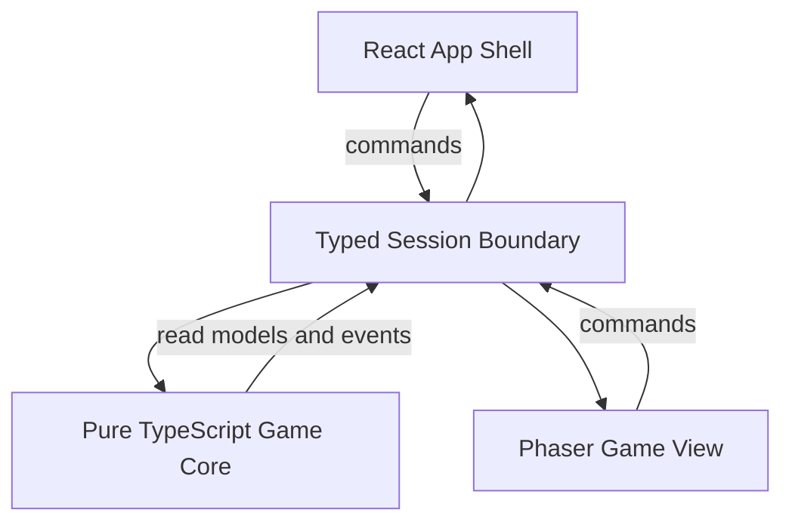

# Zaixu Xiyou Modern Game Architecture Design

**Date:** 2026-07-13

**Status:** Approved by the user after written review

**Scope:** Long-term product and technical architecture for moving from the hackathon prototype to the formal development of *Zaixu Xiyou*.

## 1. Executive Decision

*Zaixu Xiyou* is a modern reconstruction that can grow beyond the original game.

The original game is a design source and an acceptance oracle, not a runtime dependency and not an endless archaeology project. Identity-critical behavior is researched until it can be expressed as specifications, data, test vectors, screenshots, or recordings. The production game then implements that behavior in modern TypeScript. New characters, pets, equipment, levels, interfaces, stories, and mechanics may be created without an original counterpart.

Formal development starts with the single-player core loop:

```text
enter stage
  -> fight
  -> gain experience and drops
  -> equip and craft
  -> become stronger
  -> challenge the next stage
```

Pets are the first major expansion after this loop is stable. Online co-op, AI NPCs, quests, and social systems are first-class planned capabilities, but they do not own or duplicate the core combat rules.

The Windows desktop build is the primary distribution target. The browser remains the development environment and public trial surface.

## 2. Verified Starting Point

The current repository is a working hackathon prototype, not a clean-slate project. The architecture must preserve validated assets while removing demonstration-era coupling.

The baseline was re-verified before this design was written:

- Game client: 803/803 tests passed; TypeScript and Vite production build passed.
- Social server: typecheck passed; 41/41 tests and real HTTP/WebSocket smoke passed.
- Agent server: typecheck passed; 20/20 unit tests and deterministic mock integration flows passed.
- The client currently uses Phaser 4, TypeScript, and Vite.
- `game/src/scenes/BattleScene.ts` is 4,651 lines and currently mixes orchestration, persistence, networking, rendering, UI wiring, and gameplay integration.
- The current save path still includes direct browser `localStorage` access.
- The existing social server relays room messages; the final authoritative battle boundary is not yet the formal architecture.

The production build currently emits a large-bundle warning. It does not block the baseline, but code splitting becomes part of the React App Shell work.

## 3. Product Relationship With The Original

Every restored or new rule carries an origin classification:

- `canonical`: verified against an original primary source.
- `adapted`: intentionally changed from an original behavior.
- `invented`: created for *Zaixu Xiyou* without an original counterpart.

Reverse engineering is question-driven. A task such as "determine the active frames of Wukong's fifth basic attack" is valid. An open-ended task such as "extract everything in case it is useful" is not a development milestone.

The fidelity boundary is:

### Preserve as identity pillars

- Recognizable character identities and signature silhouettes.
- Core movement and combat cadence.
- Signature abilities and characteristic hit reactions.
- Major stage and boss concepts worth retaining.
- The progression flywheel connecting drops, equipment, the furnace, skills, and pets.

### Rebuild deliberately

- Code architecture and runtime ownership.
- Input mapping and controller support.
- UI information architecture and accessibility.
- Save storage and migrations.
- Networking and authoritative simulation.
- Content, animation, VFX, debugging, and level-production tools.

### Grow originally

- New characters, pets, equipment, stages, chapters, and bosses.
- AI NPC behavior and rule-constrained tools.
- Online co-op and social experiences.
- Modern quests, narrative structures, and quality-of-life features.

The shipping runtime does not execute SWF code or load assets from `tmp/`, `vendor/`, or reverse-engineering workspaces.

## 4. Architecture Principles

1. **One game truth.** React, Phaser, persistence, networking, and AI do not maintain separate authoritative copies of hero, inventory, combat, or campaign state.
2. **Simulation is renderer-independent.** Gameplay rules run without Phaser, DOM, WebSocket, a database, or an LLM SDK.
3. **Commands in, events and snapshots out.** All input sources use the same typed game boundary.
4. **Stable contracts beat generic plugins.** The architecture supports extension through explicit domain contracts, not a universal plugin loader or a stringly typed ECS.
5. **Content is compiled.** Runtime content is schema-validated, versioned, and referenced by stable IDs.
6. **Offline and online authority are explicit.** A local profile and an online profile are different trust domains.
7. **Failures are isolated.** AI, network, content, save, and presentation failures cannot silently corrupt the game core.
8. **Migration remains playable.** The prototype is replaced by vertical slices behind adapters, not by a big-bang rewrite.
9. **A feature is not complete without evidence.** Rules, presentation, tests, diagnostics, compatibility, performance, and a real playable proof are all required.

## 5. Target Technology Stack

| Layer | Technology | Responsibility |
| --- | --- | --- |
| Game view | Phaser 4 + TypeScript | Real-time world, sprites, animation, camera, world-space effects, audio cues |
| App shell and complex UI | React + DOM | Login, character select, world map, inventory, skills, furnace, lobby, settings, screen-space HUD |
| Build | Vite | Development, web production build, desktop web bundle |
| Game core | Pure TypeScript | Fixed-tick simulation and all authoritative gameplay rules |
| Content validation | JSON/TypeScript definitions + Zod schemas | Characters, actors, abilities, items, stages, encounters, recipes, presentation manifests |
| Backend | Node.js + TypeScript + Express + `ws` | Accounts, profiles, rooms, authoritative online sessions |
| Local storage | Tauri SQLite / browser IndexedDB | Offline profile, settings, caches, migration source |
| Initial server storage | SQLite behind repositories | Account and profile persistence at current scale |
| Future server storage | PostgreSQL behind the same repositories | Introduced only when multi-instance deployment or measured write contention requires it |
| AI NPC service | Independent Node.js service | Memory, provider integration, and rule-constrained tool requests |
| Desktop | Tauri 2 | Primary Windows package and secondary macOS package |
| Verification | Vitest + Playwright + protocol integration tests | Logic, simulation, services, browser flows, visual regression, packaging |
| Workspace | npm workspaces + TypeScript project references | Shared packages without replacing the repository's existing npm toolchain |

The repository keeps its current top-level applications during migration to avoid directory churn:

```text
game/                     Phaser + React client application
social-server/            account, profile, room, and future battle host
agent-server/             AI NPC service
packages/
  game-core/              renderer-independent simulation
  content/                schemas, compiler, registry, and compiled data
  protocol/               versioned network commands, events, and snapshots
  save-schema/            modular save sections and migrations
  presentation-contract/  animation, VFX, audio, and camera cue IDs
tools/
  character-lab/
  stage-lab/
  balance-lab/
  vfx-lab/
  replay-runner/
  content-inspector/
```

The tools begin as focused CLI and preview surfaces. They become full visual editors only after repeated real workflows justify the investment.

## 6. System Capability Map

### 6.1 Permanent foundation

- Fixed simulation clock, pause, stepping, and time scaling.
- Typed commands, domain events, and rejection reasons.
- Stable entity identifiers and lifecycle.
- Shared actor, transform, body, stat, resource, status, and ability contracts.
- Seeded random-number service and replay metadata.
- Content registry, origin metadata, dependency graph, and versioning.
- Modular save sections, validation, revisions, and migrations.
- Input action mapping independent from physical keys or controllers.
- Asset, audio, debug, logging, and performance surfaces.

### 6.2 First complete single-player loop

- Character identity, movement, jumping, platforms, and camera.
- Basic attacks, abilities, resources, hit detection, damage, stagger, knockback, death, and revival rules.
- Monster and boss perception, decisions, phases, projectiles, and rewards.
- Stage geometry, encounter flow, checkpoints, portals, and completion.
- Drops, pickup, ownership, inventory, equipment, appearance attachments, and selling.
- Experience, levels, stats, skill growth, and campaign progression.
- Furnace crafting, strengthening, fusion, dismantling, materials, and currency.
- World map, stage unlocks, replay, and progression walls.

### 6.3 Player experience shell

- Boot, loading, updates, and version compatibility.
- Offline guest entry, login, profile selection, and cloud status.
- Modern character selection with live previews.
- Modern world map with stage information, drops, quests, friends, and co-op entry.
- HUD, inventory, equipment, skill, furnace, quest, codex, and settings surfaces.
- Keyboard, mouse, controller navigation, remapping, subtitles, vibration, and visual assistance.

### 6.4 First expansions

- Pets: capture, AI, combat participation, aptitude, skills, growth, and evolution.
- Magic weapons: active capability, equipment integration, and independent growth.
- Quests and narrative: goals, dialogue, conditions, branches, and rewards.
- AI NPCs: memory and rule-constrained game tools.
- Online co-op: rooms, authoritative battle, prediction, interpolation, reconnect, and reward settlement.
- Social: friends, invites, chat, and safe transfers.

### 6.5 Later candidates

- Achievements and collection codex.
- Challenge towers and repeatable dungeons.
- Arena, guilds, scheduled activities, and player creation tools.

These candidates receive dedicated designs before implementation. The foundation does not promise their final gameplay now.

VIP tiers, paid gacha, advertising, paid daily attempts, and a complex live-operations backend are explicitly outside the current foundation.

## 7. Client Architecture

The client contains three clear layers:



### 7.1 React responsibilities

- Login, profile, and cloud status.
- Character selection and character information.
- World map nodes, stage information, recommended power, drops, quests, and co-op entry.
- Inventory, equipment, skill tree, furnace, quests, codex, lobby, settings, and screen-space HUD.
- Responsive layout, text, lists, forms, accessibility, keyboard/controller focus, and page transitions.

React may embed a Phaser-rendered character, skill, furnace, or background preview. React owns UI state such as the selected tab or open modal; it does not own authoritative inventory, stats, equipment, or progression.

### 7.2 Phaser responsibilities

- Real-time stage composition.
- Character, monster, pet, and NPC sprites.
- Camera, spatial audio cues, particles, trails, hit flashes, and cutscene staging.
- World-space health bars, damage numbers, and interactable markers.
- Visual interpolation from simulation snapshots.

Phaser submits commands and renders outcomes. It does not calculate authoritative damage, grant drops, mutate the long-term inventory, or directly persist state.

### 7.3 Example UI transaction

```text
React dispatches EquipItem(itemId, slot)
  -> game core validates identity, slot, ownership, and restrictions
  -> game core updates equipment and derived stats
  -> EquipmentChanged and StatsChanged are emitted
  -> React refreshes the equipment read model
  -> Phaser changes the weapon attachment
```

No layer maintains a second equipment record.

## 8. Game Core Model

### 8.1 Fixed simulation

The core advances at 30 ticks per second, preserving the existing 33.3 ms simulation lineage. Rendering is independent and targets 60 fps or better with interpolation.

Each tick executes in a stable order:

1. Collect and order commands.
2. Resolve player and AI intent.
3. Advance movement and platform physics.
4. Advance attack and ability timelines.
5. Resolve hit volumes, hit eligibility, and damage.
6. Advance statuses, survivability, death, and revival.
7. Advance encounters, drops, progression, and durable outcomes.
8. Emit domain events, rejections, and render snapshots.

The random-number source is injected and seeded. System order, seed, commands, and relevant content versions are sufficient to replay a deterministic scenario within the supported simulation boundary.

### 8.2 Commands

Commands express intent rather than direct mutation. Examples include:

- `SetMovementIntent`
- `StartJump`
- `StartAttack`
- `CastAbility`
- `Interact`
- `EquipItem`
- `CraftRecipe`
- `EnterStage`
- `SelectPet`

Invalid commands return typed rejection reasons and leave state unchanged.

### 8.3 Events and snapshots

Domain events describe facts:

- `AttackStarted`
- `HitConfirmed`
- `DamageApplied`
- `ActorStaggered`
- `ActorDied`
- `ItemDropped`
- `ItemPickedUp`
- `EquipmentChanged`
- `StageCompleted`

Presentation mappings translate those events into animation, VFX, audio, haptics, and camera cues. Render snapshots expose current visual state without exposing mutable core objects.

This distinction preserves correct miss behavior:

- `AttackStarted` triggers the swing animation, weapon trail, and swing sound even when nothing is hit.
- `HitConfirmed` and `DamageApplied` trigger impact effects, damage numbers, target reactions, and hit sounds.

Button mashing cannot accelerate attacks because commands are accepted only when the attack timeline and cancel windows permit them.

### 8.4 Actor composition without a universal ECS

Shared state is explicit:

```text
ActorState
  id / kind / owner
  transform / body
  stats / resources
  action / statuses
  abilities / tags
```

Domain-specific state remains typed:

- `HeroState`: equipment, progression, and player-specific resources.
- `MonsterState`: perception, behavior state, and drops.
- `PetState`: aptitude, learning, growth, evolution, and owner relation.
- `StageState`: encounter graph, checkpoints, boss phases, and completion.
- `EconomyState`: inventory, currencies, furnace transactions, and ownership.

This provides composition where behavior is shared without reducing every feature to untraceable generic components.

## 9. Attack And Presentation Data

An attack is a data-backed timeline plus optional mechanic code:

```text
input and buffer window
  -> startup phase
  -> animation and movement curve
  -> active hit volumes
  -> hit rules and per-target hit memory
  -> damage and status effects
  -> recovery and cancel windows
  -> combo branches
```

Presentation metadata includes:

- Animation clip and frame timing.
- Body, hand, weapon, foot, nameplate, and VFX anchors.
- Weapon trail and projectile cues.
- Swing and impact audio cues.
- Hit stop, camera shake, flash, and haptic cues.
- Attack, hurt, and interaction volumes.

A truly new mechanic may register a focused TypeScript module. Variants of established mechanics remain content data. Extensibility does not require pretending every future behavior can be expressed as JSON.

## 10. Character And Pet Asset Pipeline

The default production route is hybrid 2D:

```text
AI-assisted concept exploration
  -> character bible and standard views
  -> layered body parts and rig
  -> skeletal animation for reusable motion
  -> frame correction for signature attacks and deformation
  -> transparent spritesheet and atlas export
  -> metadata generation and automatic validation
```

AI is an offline authoring aid, not a runtime dependency. It is suitable for direction exploration, costume and color variants, constrained key-pose candidates, VFX concepts, masking, cleanup, and upscaling. It does not independently approve cross-frame identity, foot baselines, weapon grip points, motion arcs, hit frames, or final animation quality.

For a side-view character, the primary gameplay asset is the side animation set. Front, back, portrait, expression, and full turnaround views are produced when UI, narrative, equipment, or future camera needs justify them.

The runtime consumes a `CharacterBundle` independent of how it was authored:

```text
definition     identity, stats, abilities, and origin metadata
animations     clips, durations, loops, branches, and frame events
anchors        feet, hands, weapon, back, VFX, and nameplate
combat         hit volumes, hurt volumes, movement, and hit events
presentation   atlases, portraits, audio, VFX, and camera cues
validation     required actions, empty frames, bounds, anchors, and references
```

Weapons, wings, cloaks, and compatible effects are separate layers attached through stable sockets. A 3D-to-2D workflow using a rigged model and orthographic rendering is allowed for characters that justify it; the runtime output remains compatible with the same bundle.

## 11. Content Architecture

### 11.1 Registries

The content compiler manages registries for:

- Characters, pets, items, abilities, effects, actors, and presentation definitions.
- Stages, encounters, boss phases, portals, and checkpoints.
- Recipes, strengthening tables, fusion, dismantling, drops, and currencies.
- Quests, dialogue conditions, rewards, and branches.

Runtime references use stable namespaced IDs rather than filesystem paths:

```text
character.zaixu.sunwukong
ability.zaixu.staff_combo_1
item.zaixu.tail_fire_staff
pet.zaixu.flame_monkey
stage.chapter1.nine_heavens
```

An ID referenced by a released save is not silently deleted. It is retained, deprecated, replaced through explicit metadata, or migrated.

### 11.2 Independent versions

Four versions remain independent:

- `gameVersion`: client and server code.
- `contentVersion`: data, stages, and assets.
- `saveSchemaVersion`: persistent data structure and migrations.
- `protocolVersion`: client/server messages.

Compatibility checks occur before a profile or online session is loaded.

### 11.3 Build gates

The production build fails on:

- Missing or duplicate IDs.
- Unknown effects or mechanic references.
- Cyclic content dependencies.
- Missing required animations or presentation cues.
- Empty or out-of-bounds animation frames.
- Invalid anchors or combat volumes.
- A removed released item without a migration or replacement.

Development mode may render an explicit diagnostic placeholder. Production does not silently ship one.

### 11.4 Focused authoring tools

- `Character Lab`: animation, anchors, sockets, combat volumes, audio, and VFX timeline.
- `Stage Lab`: geometry, camera, spawn points, portals, encounters, and boss events.
- `Balance Lab`: actors, equipment, drops, recipes, and winnability simulation.
- `VFX Lab`: particles, trails, flashes, hit stop, camera, haptics, and mixing.
- `Replay Runner`: command replay, tick stepping, state inspection, and version comparison.
- `Content Inspector`: dependencies, unused assets, missing IDs, cycles, and package size.

## 12. Profiles, Saves, And Authority

### 12.1 Offline local profile

- Does not require login.
- Supports the complete single-player loop, including pets and the furnace.
- Uses Tauri SQLite on desktop and IndexedDB in the browser.
- Cannot participate in trusted transfers, leaderboards, or online economy operations.
- May be imported into an online profile once through an explicit validation and conversion flow.
- After conversion, continued progress uses the online profile; the old local profile is archived rather than repeatedly merged.

### 12.2 Online cloud profile

- The service owns the authoritative character, inventory, campaign, pet, and economy records.
- Enables cloud access, friends, co-op, transfers, and online AI NPC capabilities.
- The client stores a read cache, not an independently writable authoritative copy.
- Online battle rewards are settled by the authoritative server session.
- Save writes use monotonic revisions. A stale revision is rejected and re-read; inventories are never field-merged automatically.

### 12.3 Save sections

```text
identity       profile ID, mode, revision, and versions
roster         characters, levels, stats, and skills
inventory      items, equipment, materials, and currencies
campaign       chapters, stages, checkpoints, and difficulty
pets           ownership, aptitude, skills, evolution, and active pet
quests         active, completed, branches, and dialogue flags
collections    codex, achievements, and unlocks
```

Each section owns an explicit migration. Direct `window.localStorage` access is removed behind repositories and retained only as an import source for prototype saves.

Crafting, strengthening, selling, transfer, and reward collection are atomic transactions. Failure restores the prior valid state.

## 13. Online Architecture

Single-player local sessions and online sessions use the same game core with different authorities.


For online sessions:

- The server owns monsters, bosses, hit settlement, hero damage, drops, experience, and stage events.
- Clients send versioned commands with sequence numbers.
- A local player may use bounded movement prediction.
- Remote actors use interpolation.
- Snapshots acknowledge commands and provide correction state.
- Reconnect is a session state machine, not an implicit WebSocket retry.

The server evolves as a modular monolith:

1. Account, profile, and room modules.
2. Authoritative battle rooms in the same deployable process if capacity allows.
3. Dedicated battle workers only after load evidence requires process separation.

The AI Agent service remains independent because its latency, cost, cancellation, and failure behavior differ from real-time simulation. AI can request typed tools; authority validates and applies them. An AI response never directly writes an inventory or combat state.

## 14. Failure Handling And Diagnostics

### 14.1 Failure isolation

- Content errors fail compilation or startup validation.
- Invalid game commands return typed rejections without partial mutation.
- Network failures enter explicit disconnected, reconnecting, failed, or returned-to-lobby states.
- AI calls have timeout, cancellation, and scripted fallback paths.
- Save writes use transactions, backups, and the previous valid revision.
- Presentation failures may lose a cosmetic effect, but cannot change authoritative rules.

### 14.2 World Inspector

The development build exposes:

- Tick, render FPS, frame time, seed, and version information.
- Entity IDs, actor state machines, stats, resources, and effect sources.
- Platform, attack, hurt, interaction, and projectile volumes.
- Command queues and rejection reasons.
- Network latency, sequence numbers, acknowledgements, and drift.
- Pause, single-step, speed control, and command injection.

### 14.3 Reproducible bug bundle

A single action exports:

```text
gameVersion
contentVersion
saveSchemaVersion
protocolVersion
randomSeed
recentCommands
domainEvents
safeStateSnapshot
structuredLogs
screenshot
```

Secrets, access tokens, and unrestricted private chat content are excluded.

## 15. Verification And Performance

### 15.1 Verification layers

1. Content schema and dependency validation.
2. Pure unit tests for formulas and state machines.
3. Headless simulation scenarios and golden results.
4. Database, HTTP, and WebSocket integration tests.
5. Playwright browser gameplay flows.
6. Visual screenshot and video regression.
7. Desktop installer smoke and online load tests.

Mock responses do not replace a real upstream protocol validation. Screenshots do not replace gameplay assertions.

### 15.2 Initial performance contract

- Reference Windows machine: 1920x1080 at 60 fps.
- Combat render frame time: P95 at or below 16.7 ms.
- Simulation: 50 active actors at 30 Hz with tick P95 at or below 5 ms.
- Cached stage transition target: interactive within two seconds.
- Assets load by chapter or stage; memory must not grow linearly across repeated stage transitions.

Online player count and latency budgets are decided in the co-op design. Hackathon capacity targets do not automatically become production contracts.

### 15.3 Definition of done

A system is complete only when all are present:

1. Player experience and boundary rules.
2. Unambiguous state ownership.
3. Content definitions and origin metadata.
4. Renderer-independent rule implementation.
5. Complete animation, audio, UI, and feedback.
6. Normal, edge, and failure-path tests.
7. Inspectable state and replayable failures.
8. Save, network, version, and performance compatibility.
9. A real playable proof in the production build.

## 16. Migration Strategy

The migration uses a strangler approach.

### 16.1 Preserve

- Verified pure TypeScript rules after source and behavior audit.
- The 803-test client baseline and existing service tests.
- Original data tables, extracted specifications, reference captures, and asset tooling.
- Working account, room, and AI service capabilities behind new contracts.

### 16.2 Wrap temporarily

- `BattleScene` behind a rendering and input adapter.
- Existing Phaser UI until each React replacement is accepted.
- Existing network clients behind the versioned protocol package.
- Existing saves behind an import repository.

### 16.3 Rewrite incrementally

- World state and tick orchestration.
- Typed session boundary, snapshots, replays, and diagnostics.
- React App Shell.
- Content compiler and registries.
- Save repositories and cloud profile transactions.
- Authoritative online battle rooms.

### 16.4 Retire after replacement

- Duplicate gameplay state held by scenes or UI.
- Direct `window.localStorage` writes.
- Client-host authoritative settlement.
- Hard-coded content coordinates and IDs embedded in scene orchestration.
- Debug-only backdoors that bypass production command validation.

Every temporary adapter has an explicit replacement and removal condition.

## 17. Dual-Run Parity Safety Net

Before a legacy subsystem is replaced, captured commands and seeded scenarios run through both the legacy adapter and the new core. The parity report compares:

- Position and movement state.
- Action and combo stage.
- HP, MP, statuses, damage, stagger, and knockback.
- Domain events, drops, rewards, and state hash.

Every difference is classified as canonical fidelity, an approved adaptation, or a bug. "Looks close" is not a switch-over criterion.

## 18. Milestones

### 18.1 First engineering milestone: Combat Core Slice

One Wukong and one normal monster prove the new foundation:

- Movement, jumping, five-stage basic attack, hit detection, damage, stagger, knockback, and death.
- Weapon attachment, trails, VFX, audio, hit stop, camera shake, and HUD.
- Headless simulation, seeded replay, render snapshots, and a Phaser adapter.
- Parity report against the prototype and original reference where the behavior is identity-critical.
- A 50-actor benchmark satisfying the initial simulation budget.
- Automated tests, a production-build recording, and a one-action reproducible bug bundle.

No new character or new stage is required for this milestone. Its purpose is to prove that future content can safely use the new foundation.

### 18.2 First player milestone: Chapter One

```text
modern offline/login entry
  -> modern character select
  -> modern world map
  -> connected stages and bosses
  -> drops and equipment
  -> skill growth
  -> furnace
  -> save
  -> replay at greater difficulty
```

Wukong is the required first character. The exact stage count is decided during Chapter One design rather than guessed in the architecture document.

### 18.3 First expansion milestone: Pets

After Chapter One's combat, progression, save, content, and presentation contracts are stable, the first pet vertical slice implements capture, active companion AI, growth, one skill-learning path, and one evolution chain. It validates that an independent combat actor and growth axis can extend the core without hero-specific branching.

## 19. Migration Order

1. Tag and archive the verified hackathon baseline and evidence.
2. Add `packages/game-core`, `packages/content`, `packages/protocol`, `packages/save-schema`, and `packages/presentation-contract` without moving current applications.
3. Implement the Combat Core Slice and legacy/new dual-run comparison.
4. Move complete combat, movement, skills, AI, drops, and encounter behavior behind the new core.
5. Complete the first chapter loop with progression, equipment, furnace, and formal saves.
6. Introduce the React App Shell and migrate login, character select, world map, and complex UI surfaces.
7. Design and implement the pet expansion against the proven contracts.
8. Design authoritative co-op capacity, reconnect, and reward settlement before replacing the hackathon host-authority path.

Each step leaves the primary flow playable. Replacement code and migration proof must exist before legacy behavior is deleted.

## 20. Decisions Deferred By Explicit Trigger

These are not unresolved placeholders; each has a defined decision point:

- Exact Chapter One stage count: decided during Chapter One experience design.
- Maximum co-op players and latency budget: decided during authoritative co-op design and load modeling.
- PostgreSQL migration: triggered by multi-instance deployment or measured SQLite write contention.
- Full visual editor investment: triggered by repeated authoring workflows that are measurably slower or error-prone with schema files and focused previews.
- Arena, guilds, scheduled activities, and player creation tools: each requires its own product and authority design before entering the roadmap.
- Commercialization systems: excluded unless the product goal explicitly changes.

## 21. Architecture Acceptance Criteria

This architecture is considered established when:

- The approved contracts and origin policy are committed and referenced by implementation plans.
- New core packages can run without Phaser or browser globals.
- One attack is processed command-to-event-to-render without scene-owned damage rules.
- The same seeded scenario can be replayed headlessly.
- React and Phaser consume one authoritative state through typed boundaries.
- Content is addressed by stable IDs and production builds reject invalid references.
- Offline and online profiles have explicit, tested authority and migration boundaries.
- Existing behavior remains playable throughout migration.
